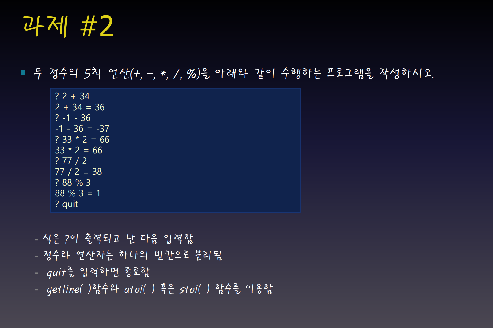
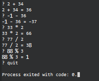

## 과제2 (Assignment_02)
안녕하세요.  
**[고급프로그래밍]** 과목을 수강중인 광운대학교 로봇학부 소속 24학번 박기홍입니다. 과제2에 대한 Qt 프로젝트를 제출드립니다. 
감사합니다.

### 개발 환경
- Windows11
- Qt Creator 15.0.1(Community)
- Desktop Qt 6.8.2 MinGW 64-bit
---

### 과제 설명

### 실행 결과
